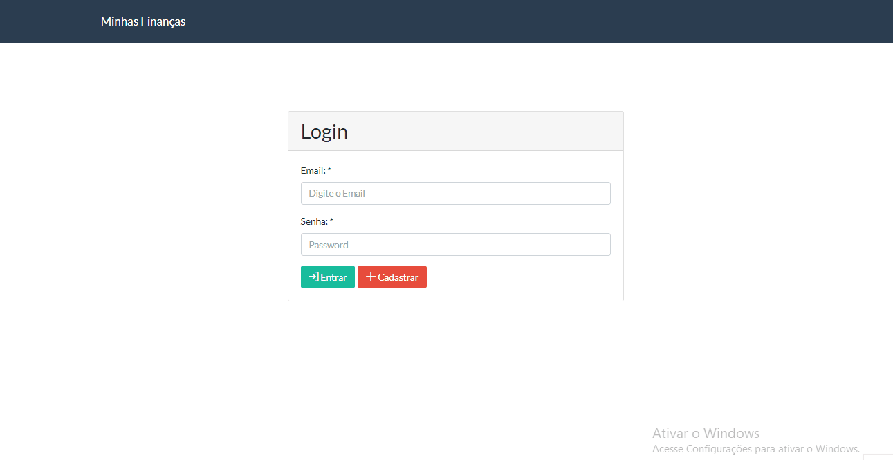

# Spring Boot + React JS: Desenvolva Aplicações Web Completas

Descrição: Curso Full Stack com Spring Boot e React JS, do zero à nuvem.

Link: https://www.udemy.com/share/102a8mAEQdcFtQQng=/

## 💻 Projeto do curso

Sistema de finanças pessoais com cadastro de Usuários e Lançamentos e autenticação simples. 
Engloba uma API construída com Spring Boot e uma aplicação cliente desenvolvida com React.

## :camera: Demonstração

## :rocket: Conceitos e tecnologias

✔️ Spring Boot

✔️ REST e RESTFul

✔️ Testes unitários, integração e de API com JUnit e Spring Test.

✔️ Banco de dados PostgreSQL

✔️ Configuração de CORS (Cross-origin Resource Sharing)

✔️ DTO (Data Transfer Object)

✔️ Testes de APIs com Postman

✔️ React envolvendo as bibliotecas axios, bootswatch, currency-formatter, primereact e toastr

✔️ Integração e Deploy Contínuo envolvendo o Github e Heroku

## :phone: Contato

 Linkedin [https://www.linkedin.com/in/danyllo-valente-da-silva-3569b460](https://www.linkedin.com/in/danyllo-valente-da-silva-3569b460)

:postbox: E-mail [danyllo.dvs@gmail.com](danyllo.dvs@gmail.com)
